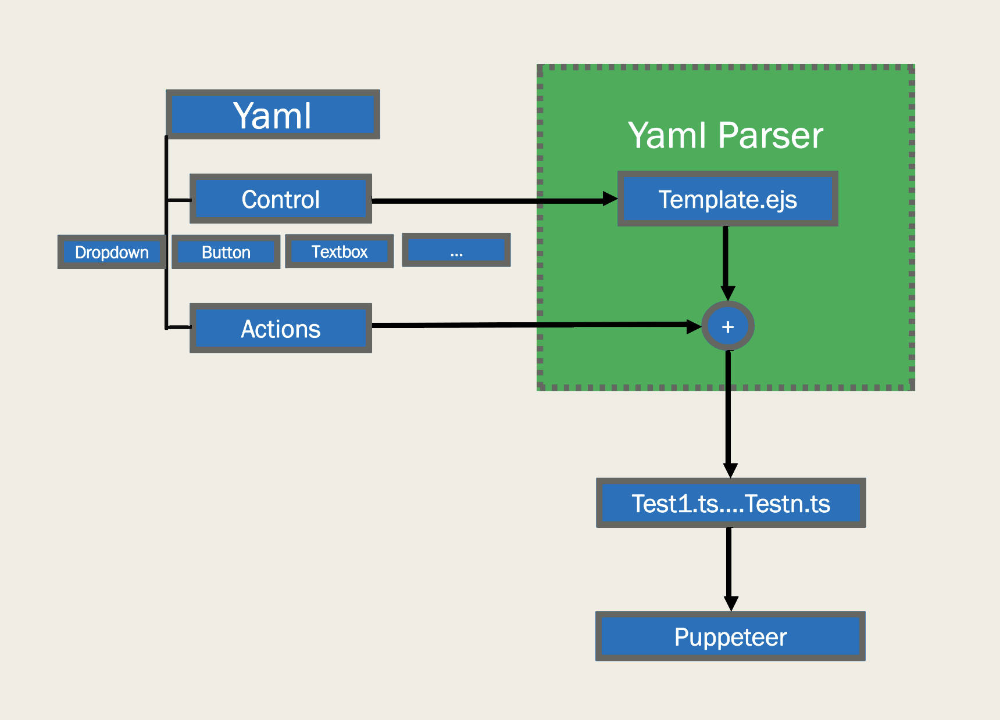

# UI Automation Tool
This is a fully extensible automation tool offering the capability to perform e2e testing of any website's user-interface by means of test cases auto-generated using a simple yaml spec file. We provide in-built ejs templates for various controls and navigation utilities which can be consumed to automate the UI experience.

# Features
* Built on top of [Puppeteer](https://developers.google.com/web/tools/puppeteer) 
* Provides following controls out of the box:
    * Button
    * Textbox
    * Dropdown

* Extensibility to add controls and include/update their functions
* Simple yaml spec file to auto-generate test cases
* Templates for test-cases provided in ejs format
* Automate logging into websites and use saved context for subsequent sessions
* Capability to write and add custom test suites in typescript using mocha/chai to include in the automation in addition to auto-generated tests. 
* Functionality to take screen-shots for failed test cases, which would help in debugging


# Architecture
<p>
  
</p>

# Requirements

- [NodeJS](https://nodejs.org/en/download/)
- [TypeScript](https://www.typescriptlang.org/index.html#download-links)
- [Mocha](https://mochajs.org/)

# Setup

1. Create .env file with the below values as env variables

```
/* username to be consumed during login */
USERNAME=<Username>

/* password to be consumed during login */
PASSWORD=<Password>

/* To view the browser performing the navigation, use 0, else 1 to run in the background */
HEADLESS=<0 or 1>

/* If jquery isn't injected in the website by default. Use 1 to inject */
INJECTJQUERY=<0 or 1>

/* Used for 'npm run login' to define which login mechanism is to be consumed. You can find them at Login folder */
LOGIN=<microsoft or flipkart or any other>

```

2. Create a spec.yaml file, based on which test cases would be generated. You can find a yaml file present [here](./SampleSpecFiles/specblocks.yaml), explaining how it is to be generated. 
Sample yaml files, which can be consumed for reference are present in the SampleSpecFiles

# Getting Started

1. Install all the required dependencies

    ```
    $ npm install
    ```

2. (Optional) Login to the website

    ```
    $ npm run login
    ```

3. Auto-generate the test cases

    ```
    $ npm run parseyaml
    ```

4. Run the tests

    ```
    $ npm run test
    ```

5. View the test report

    ```
    $ npm run genreport
    ```

    Logs are present at ./UITesting.log


# Contributing

This project welcomes contributions and suggestions.  Most contributions require you to agree to a
Contributor License Agreement (CLA) declaring that you have the right to, and actually do, grant us
the rights to use your contribution. For details, visit https://cla.opensource.microsoft.com.

When you submit a pull request, a CLA bot will automatically determine whether you need to provide
a CLA and decorate the PR appropriately (e.g., status check, comment). Simply follow the instructions
provided by the bot. You will only need to do this once across all repos using our CLA.

This project has adopted the [Microsoft Open Source Code of Conduct](https://opensource.microsoft.com/codeofconduct/).
For more information see the [Code of Conduct FAQ](https://opensource.microsoft.com/codeofconduct/faq/) or
contact [opencode@microsoft.com](mailto:opencode@microsoft.com) with any additional questions or comments.